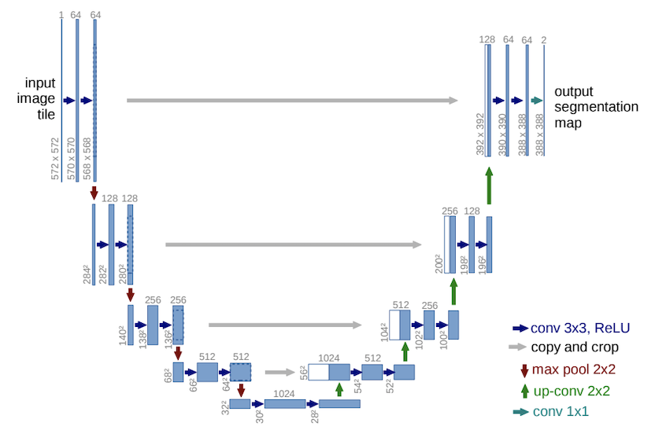

# 🛣️ Lane Detection using U-Net

Lane detection is a crucial **computer vision task** that involves identifying the boundaries of driving lanes in an image or video of a road scene.  
It plays a vital role in **autonomous vehicles** and **Advanced Driver Assistance Systems (ADAS)**.  

Traditional methods like the **Hough Transform** struggle under varying lighting or shadow conditions.  
With the rise of **Convolutional Neural Networks (CNNs)**, lane detection has become more robust and accurate — especially when using the **U-Net architecture** for semantic segmentation.

---

## 🧠 U-Net Architecture

U-Net is a **deep learning architecture** designed specifically for **semantic segmentation** tasks — dividing an image into meaningful regions.  
In the context of **lane detection**, it helps the model learn both the **line features** and **contextual information** around lanes.

- The encoder captures **spatial features**.
- The decoder reconstructs **pixel-level segmentation** maps.

This architecture effectively improves both **accuracy** and **real-time performance** in complex road environments.

**U-Net Architecture Overview:**

---

## 🚗 TuSimple Dataset

The **TuSimple dataset** is a large-scale benchmark dataset widely used for **lane detection and perception** research.

- **Total Images:** 6,408  
- **Resolution:** 1280 × 720  
- **Splits:**  
  - Training: 3,626 images  
  - Validation: 358 images  
  - Testing: 2,782 images  
- **Conditions:** Includes images under varying **weather** and **lighting** conditions.

### 📥 Downloads

- [📁 Download Full Dataset — TuSimple](https://github.com/TuSimple/tusimple-benchmark)
- [📦 Download Preprocessed Dataset — TuSimple_Preprocessed](https://www.kaggle.com/)
- [🔗 Kaggle Notebook for This Project](https://www.kaggle.com/)

---

## ⚙️ Getting Started

To run this project, you can download the **`UNET.ipynb`** file from this repository and the dataset from the links above.  
You can implement the full workflow in **Kaggle** or **Google Colab**.

### 🔧 Requirements

- TensorFlow >= 2.0.0  
- Keras  
- GPU (NVIDIA T4 or similar recommended)  
- CUDA Toolkit  

---

## ⚡ Why Kaggle?

Kaggle provides a built-in **GPU accelerator**, which significantly speeds up training.  
This project was trained using **GPU T4 ×2**, which made the training faster compared to using CPU.  
Alternatively, you can use **Google Colab**, which also provides a free GPU runtime.

---

## 🏋️ Training the Model

Training parameters used:

| Parameter | Value |
|------------|--------|
| GPU | T4 ×2 |
| Epochs | 32 |
| Batch Size | 8 |
| Dataset | TuSimple_Preprocessed |
| Accuracy | High |
| Loss | Low |

---
[image alt](https://github.com/gnanasaiprakash2000/Lane-detection/blob/5ca86e255757c5b3c17e57c99c9d4f37249793b5/images/291383146-2dc80427-82b1-4367-8bd3-96978ec7533f.png)
